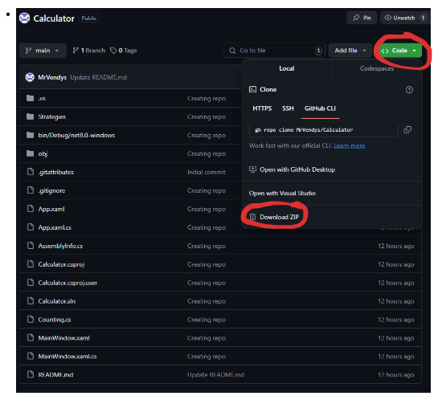

# Kalkulačka

## 📜 Popis projektu

Projekt je vytvořen za účelem otestování znalostí pro ucházení se o praxi ve firmě

Jednoduchá kalkulačka za použití návrhového vzoru "STRATEGY"

## ⚙️ Funkce

- Základní operace (+,-,*,/)
- Pokročilé operace (!,√,^)
- Priority operací
- Podpora klávesnice
- Mazání znaku

## 🧠 Použité techniky
- WPF
- OOP

## 🎮 Ovládání
- Buď pomocí klávesnice nebo klikání na jednotlivá tlačítka
- Tlačítko "=" vypočítá celý příklad
- Tlačítko "←" smaže znak

## 📂 Struktura projektu

- **📂Strategies**: Složka pro třídy návrhového vzoru Strategy
- **MainWindow.xaml**: Hlavní okno aplikace
- **MainWindow.xaml.cs**: Logika hlavního okna

## 🔧 Požadavky

- .NET Framework 4.7.2 nebo vyšší
- Visual Studio 2019 nebo novější

## 🛠️ Instalace
### .exe souboru
- Kliknout zde na .exe soubor
### Celé řešení (kód)
- Vpravo nahoře zelené tlačítko "CODE"
- Download ZIP

